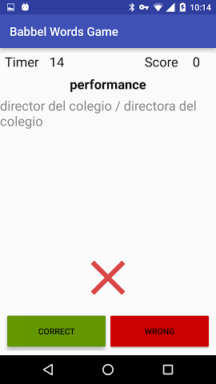

Babbel Words Game Android Application
=====================================

This repository holds the source code of the Words Game Application, a simple Android Game for language lerners.
This application was created by [Mohsen Mirhoseini Argi](http://mirhoseini.com), as part of the technical assessment by the [Babbel](http://babbel.com) team.

--------------------
### What is this repository for? ###

* Babbel Words Game Android Application
*       Version:  1.0
* Last Update: Wed Jun 8, 2016

--------------------
### Development Tools ###

* Android Studio v2.2
* gradle-plugin v2.10
* Android SDK Build Tools 23.0.3
* CompileSDKVersion 23

--------------------
### Dependencies ###

* Android Support Tools (appcompat, vector ) v23.4.0
* Dagger v2.4
* RxJava v1.1.3
* RxAndroid v1.1.0
* Butterknife v8.0.1
* Timber v4.1.2
* AutoValue v1.2
* AppSettings v1.0.1
* AndroidUtils v1.0.0
* Retrolambda v3.2.5
* android-apt v1.8

--------------------
### Application Structure ###

The Application implemented and structured bases on the MVP pattern best practice, contributed by [Antonio Leiva](http://antonioleiva.com/mvp-android/).

Whole game functionality is implemented in "Core-Lib" module using pure Java. The "App" module contain all codes required for game to load on Android.

The application has one Main Activity which is responsible for presenting whole game views consist of two fragments. (Menu and Game Fragments)

All activity and fragments lifecycle and player behaviours are implemented, and according to device size and situation user get a good view and UX.

The view (MainActivity), contain a reference to the presenter. The only thing that the view will do is calling a method from the presenter every time there is an interface action or communicate with it's Fragments.

The presenter (GamePresenter), is responsible to act as the middle man between view and game different parts (namely ScoreManager, TimeManager, ...). It retrieves data from "words.json" using Gson and load it to Model and handle game behaviours. It also decides what happens when user interact with the view.

Time and Questions are managed by [RxJava](https://github.com/ReactiveX/RxJava) & [RxAndroid](https://github.com/ReactiveX/RxAndroid) contributed by [ReactiveX](http://reactivex.io).

Dependency Injections are being managed by [Dagger](https://github.com/google/dagger) created by [Square](http://square.github.io) and now maintained by Google [Google](http://google.github.io/dagger/).

The disk cache for saving user HighScore is managed using [AppSettings](https://github.com/mmirhoseini/app_settings) library, a wrapper for Android SharedPreferences, which takes advantage of HashMaps for faster save and retrieval from memory, developed and published on jCenter by [myself](http://mirhoseini.com).

Some minor Android common functions are managed using [AndroidUtils](https://github.com/mmirhoseini/utils) library, developed and published on jCenter by [myself](http://mirhoseini.com).

Whole projects Dependencies are placed in "libraries.gradle" to avoid version conflicts and redundant in different modules.

Icons are using Android new Vector assets feature for a better UI.

To make the game more juicy and having a better UX, I have used Android animations using AnimationSet in XML files.

### Time Distribution ###

I've spent about 6 hours on the project consist of:
<ol>
<li>About an hour thinking about the UI/UX and how to manage game parts like time, words data, score, ...</li>
<li>About 30 minutes preparing whole project structure, core-lib sub-module, dependencies that I'm going to use and implementing MVP using Dagger.</li>
<li>About 1 hour developing the View in app module and about 3 hour developing logic and algorithm of the game in core-lib module.</li>
<li>About 30 minutes to complete documentation and push to GitHub</li>
</ol>

### Decisions making ###

I was about to create a classic Android Application using old method of all codes in a single MainActivity because of time shortage!
But I prefer to be a professional and spend more time to have a clean-code using MVP and Dagger.

Having one presenter for both menu and game was cause by time shortage, and if I had more time I would separate them because of their different functionality.

I always prefer to user libraries that makes development easier and let me think more about the logic of the Application and what to do, instead of how to do.

I am also a fan of Functional Programming and always use Retrolambda to use this ability in all Android versions, and try to think more functional.

### Improvements ###

Fist of all, I would add some testes to check my application functionality during development and avoid side effects while adding new features.
By the way, because of implementing MVP methodology, Unit testing is so easy and we can also add some Android UI Instrumentation Tests using Robolectric.

I would also refactor some parts that was written too fast, and somehow are not clean. (for instance TimeManager only holds the time data, and time is being managed with presenter!)